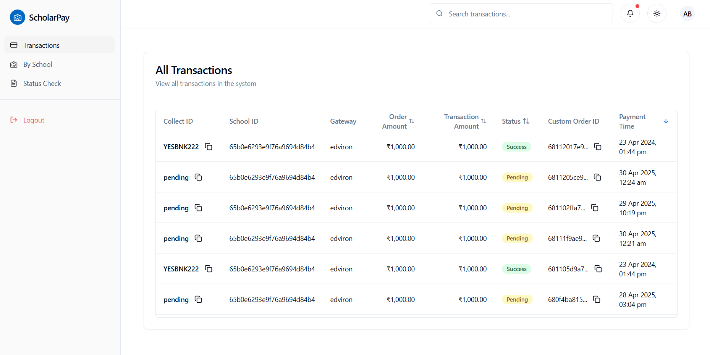
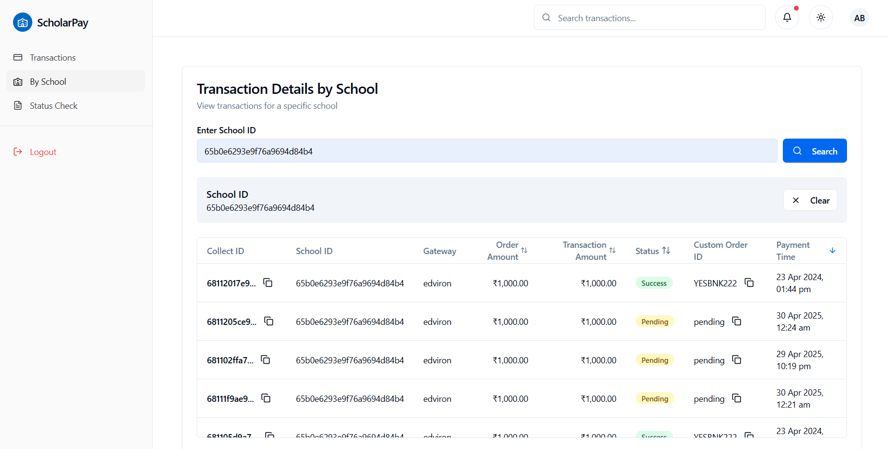
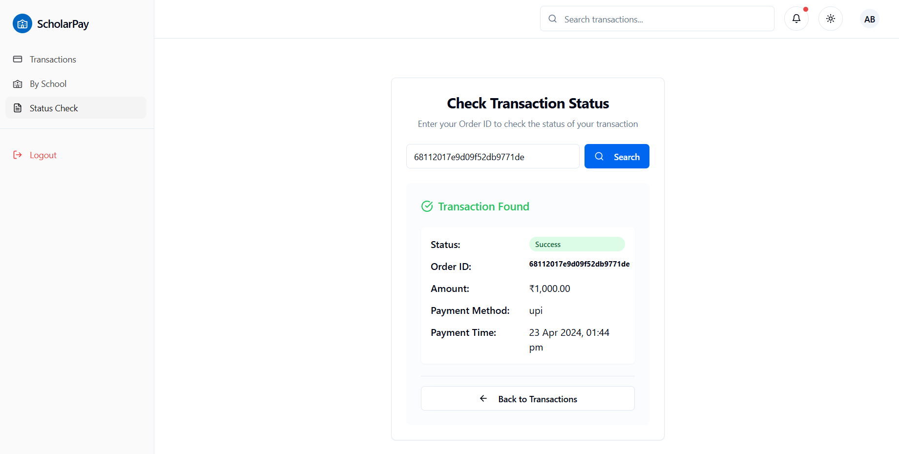

# School Payment Service Frontend

A modern React application for managing school payment transactions, built with React, TypeScript, and Tailwind CSS.

## Table of Contents

- [Overview](#overview)
- [Features](#features)
- [Screenshots](#screenshots)
- [Project Setup](#project-setup)
- [Pages and Functionality](#pages-and-functionality)
- [API Integration](#api-integration)
- [Authentication](#authentication) 
- [Tech Stack](#tech-stack)

## Overview

The School Payment Service Frontend is a comprehensive web application designed to manage and track payment transactions for schools. It provides a user-friendly interface for administrators to view, filter, and check the status of transactions.

## Features

- **Authentication System**: Secure login and registration
- **Transaction Management**: View all transactions with filtering and sorting
- **School-specific Transactions**: Filter transactions by school ID
- **Status Checking**: Verify transaction status by order ID
- **Responsive Design**: Works on desktop and mobile devices
- **Dark/Light Mode**: Toggle between themes for better user experience

## Screenshots

*Note: Replace these placeholder images with actual screenshots of your application*


### Transactions Page


### School-specific Transactions


### Status Check

## Project Setup

### Prerequisites

- Node.js (v16 or higher)
- npm or yarn

### Installation

1. Clone the repository:
   ```bash
   git clone https://github.com/yourusername/school_payment_service_frontend.git
   cd school_payment_service_frontend
   ```

2. Install dependencies:
   ```bash
   npm install
   # or
   yarn install
   ```

3. Create a `.env` file in the root directory with the following variables:
   ```
   VITE_API_URL=https://school-payment-service-backend.onrender.com/api
   ```

4. Start the development server:
   ```bash
   npm run dev
   # or
   yarn dev
   ```

5. Build for production:
   ```bash
   npm run build
   # or
   yarn build
   ```

6. Preview the production build:
   ```bash
   npm run preview
   # or
   yarn preview
   ```

## Pages and Functionality

### Sign In / Sign Up
- User authentication with email and password
- Role-based access (admin or school)
- Protected routes for authenticated users

### Transactions Page
- View all transactions in a paginated table
- Sort by various fields (payment time, amount, status)
- Copy transaction IDs with a single click
- Filter transactions by various criteria
- Responsive table with horizontal scrolling on mobile

### School Transactions Page
- Search for transactions by school ID
- View school-specific transactions
- Same sorting and pagination features as the main transactions page
- Copy functionality for transaction IDs

### Status Check Page
- Check transaction status by entering an order ID
- Display detailed transaction information when found
- User-friendly error messages
- URL parameter support for direct access to a specific transaction

### Settings Page
- User profile management
- Application preferences
- Theme toggle (light/dark mode)

### Not Found Page
- Custom 404 page for better user experience
- Redirect to main application

## API Integration

The application integrates with a RESTful API for all data operations. The API endpoints include:

- `/auth/login` - User authentication
- `/auth/register` - User registration
- `/auth/me` - Get current user information
- `/payments/create-payment` - Create a new payment
- `/payments/status/:id` - Check payment status
- `/transactions` - Get all transactions with filtering
- `/transactions/school/:id` - Get transactions for a specific school

The application includes a mock data mode for development without a backend.

## Authentication

The application uses JWT (JSON Web Token) for authentication. The token is stored in localStorage and included in the Authorization header for API requests. The application handles token expiration and redirects to the login page when necessary.

## Tech Stack

- **React**: UI library
- **TypeScript**: Type-safe JavaScript
- **Vite**: Build tool and development server
- **React Router**: Client-side routing
- **TanStack Query (React Query)**: Data fetching and caching
- **Axios**: HTTP client
- **Tailwind CSS**: Utility-first CSS framework
- **Radix UI**: Accessible UI components
- **Lucide React**: Icon library
- **React Hook Form**: Form validation
- **Zod**: Schema validation
- **Recharts**: Data visualization
- **date-fns**: Date utilities